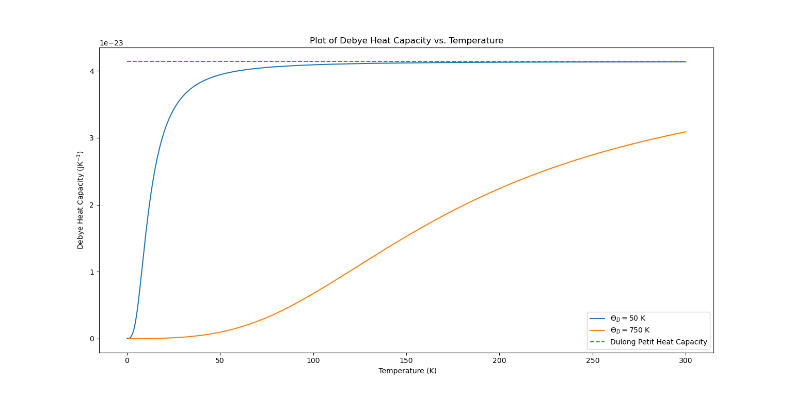
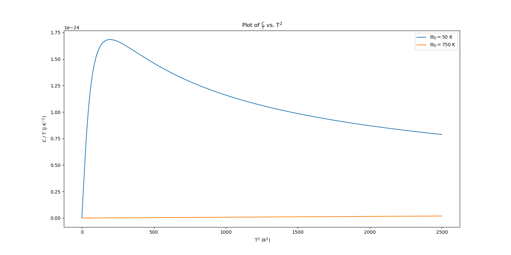

# QAtS-Problem-Sheet-3
This code is my solution to the 3rd problem sheet of my QAtS module. This task involved numerically finding the Debye heat capacity for a monatomic solid over a temperature range from 0 K to 300 K, using Debye temperatures of 50 K and 750 K.

  Problem Sheet 9.py: File containing code for problem
  Yr2_Sem1_Problem Sheet_9.pdf: Problem sheet with task and extension
  Debye Heat Capacity vs. Temperature.png: Plot of Debye Heat Capacity vs. Temperature (Task)

  CoverT vs. Tsquared.png: Plot of C/T vs. T^2 (Extension)

